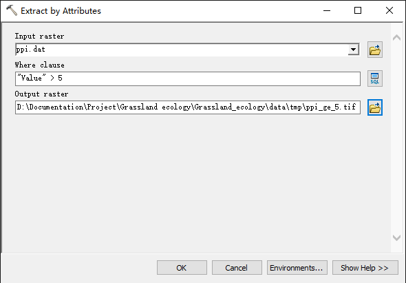

# 基于 Sentinel-2 卫星数据的像元三分法模型

## 一、基本概念

1. 端元：组成混合像元的纯净地物被称作是端元；
2. 混合像元产生的原因：

   * 传感器的采样频率小于或等于地表空间变异的频率，使得单个像元对应地面的面积较大， 故包含了多种地物类型；

   * 相对于地表的变异程度，传感器的空间分辨率过于精细， 使得有些像元不可避免地横跨地物边界。
3. 确定端元类型的方法：

   * 从光谱库中选择；
   * 直接从影像上提取；
   * 结合光谱库和影像上提取的波谱，先从影像上选择相对单一的像元的光谱，然后对光谱进行分解，通过与光谱库中的光谱进行对比，确定端元的类型和波谱值。
4. 最大噪声比变换（MNF）：是一种连续使用主成分分析（PCA）对高光谱遥感数据进行压缩和降维的方法。

   * 该变换通过引入噪声协方差矩阵以实现对噪声比率的估计；
   * 首先，通过一定方式（比如对图像进行高通滤波）获取噪声的协方差矩阵；
   * 然后将噪声协方差矩阵对角化和标准化，即可获得对图像的变换矩阵，该变换实现了噪声的去相关和标准化，即变换后的图像包含的噪声在各个波段上方差都为 1，并且互不相关；
   * 最后对变换后的图像再做主成分变换，从而实现了 MNF 变换，此时得到的图像的主成分的解释方差量对应于该主成分的信噪比大小。
5. 像元纯度指数（PPI）：是表征多波段遥感图像中每个像元“纯度”的指标，该值越大，说明对应的像元越接近纯像元。

   * 它将 N 维像元点投影到一个随机的单位向量上，如果该像元纯度大，则应该更接近单位向量的端点，否则位于单位向量的内部。 
   * 通过这种投影方式迭代多次后，纯度大的像元靠近端点的概率值大， 纯度小的像元靠近端点的概率值小， 于是可得到一幅反映端元纯度大小的影像。

## 二、操作步骤

## 1. 下载并处理 Sentinel 数据

参考：[Be-Zero/Sentinel2_pretreatment](https://github.com/Be-Zero/Sentinel2_pretreatment)

## 2. 计算 NDVI

1. 提取 NIR 波段和 R 波段：

   * Arcgis 工具为：Data Management Tools/Layers and Table Views/Make Raster Layer；

   * R 波段为 band 1，NIR 波段为 band 4；

     

2. NDVI 计算：

   * Arcgis 工具：Spatial Analyst Tools/Map Algebra/Raster Calculator；

   * NDVI 公式为 $\frac{NIR-R}{NIR+R}$ ；

   * 栅格计算器公式为 `("NIR.tif" - "R.tif") / ("NIR.tif" + "R.tif")` ；

     

     

3. 波段批量提取

   * 使用 arcpy 对波段进行批量提取，需要注意的是，arcgis 版本需为 10.7 以上，否则在保存栅格数据时可能会出错：

     ```python
     # coding:utf-8
     import arcpy
     from arcpy.sa import *
     import os
     
     def get_R(out_path):
         files = arcpy.ListRasters("*", "tif")  # 查找目录中的 tif 格式文件
         for file in files: # 遍历
             try:
                 arcpy.MakeRasterLayer_management(file, "red", band_index="1") # 提取 R 波段
                 Raster("red").save(out_path + os.sep + file)
                 print file + " is done!"  # 完成提示
             except:
                 print file + " has a bug."  # 筛选出错误文件
     
     
     def get_B(out_path):
         files = arcpy.ListRasters("*", "tif")  # 查找目录中的 tif 格式文件
         for file in files: # 遍历
             try:
                 arcpy.MakeRasterLayer_management(file, "blue", band_index="3") # 提取 B 波段
                 Raster("blue").save(out_path + os.sep + file)
                 print file + " is done!"  # 完成提示
             except:
                 print file + " has a bug."  # 筛选出错误文件
     
     
     def get_G(out_path):
         files = arcpy.ListRasters("*", "tif")  # 查找目录中的 tif 格式文件
         for file in files: # 遍历
             try:
                 arcpy.MakeRasterLayer_management(file, "green", band_index="2") # 提取 G 波段
                 Raster("green").save(out_path + os.sep + file)
                 print file + " is done!"  # 完成提示
             except:
                 print file + " has a bug."  # 筛选出错误文件
     
     
     def get_NIR(out_path):
         files = arcpy.ListRasters("*", "tif")  # 查找目录中的 tif 格式文件
         for file in files: # 遍历
             try:
                 arcpy.MakeRasterLayer_management(file, "nir", band_index="4") # 提取 NIR 波段
                 Raster("nir").save(out_path + os.sep + file)
                 print file + " is done!"  # 完成提示
             except:
                 print file + " has a bug."  # 筛选出错误文件
     
     
     def get_VRE1(out_path):
         files = arcpy.ListRasters("*", "tif")  # 查找目录中的 tif 格式文件
         for file in files: # 遍历
             try:
                 arcpy.MakeRasterLayer_management(file, "vre1", band_index="1") # 提取 VRE1 波段
                 arcpy.Resample_management(Raster("vre1"), out_path + os.sep + file, 10, "NEAREST")  # 对波段上采样
                 print file + " is done!"  # 完成提示
             except:
                 print file + " has a bug."  # 筛选出错误文件
     
     
     def get_VRE2(out_path):
         files = arcpy.ListRasters("*", "tif")  # 查找目录中的 tif 格式文件
         for file in files: # 遍历
             try:
                 arcpy.MakeRasterLayer_management(file, "vre2", band_index="2") # 提取 VRE2 波段
                 arcpy.Resample_management(Raster("vre2"), out_path + os.sep + file, 10, "NEAREST")  # 对波段上采样
                 print file + " is done!"  # 完成提示
             except:
                 print file + " has a bug."  # 筛选出错误文件
     
     
     def get_VRE3(out_path):
         files = arcpy.ListRasters("*", "tif")  # 查找目录中的 tif 格式文件
         for file in files: # 遍历
             try:
                 arcpy.MakeRasterLayer_management(file, "vre3", band_index="3") # 提取 VRE3 波段
                 arcpy.Resample_management(Raster("vre3"), out_path + os.sep + file, 10, "NEAREST")  # 对波段上采样
                 print file + " is done!"  # 完成提示
             except:
                 print file + " has a bug."  # 筛选出错误文件
     
     
     def get_NN(out_path):
         files = arcpy.ListRasters("*", "tif")  # 查找目录中的 tif 格式文件
         for file in files: # 遍历
             try:
                 arcpy.MakeRasterLayer_management(file, "nn", band_index="4") # 提取 NN 波段
                 arcpy.Resample_management(Raster("nn"), out_path + os.sep + file, 10, "NEAREST")  # 对波段上采样
                 print file + " is done!"  # 完成提示
             except:
                 print file + " has a bug."  # 筛选出错误文件
     
     
     def get_SWIR1(out_path):
         files = arcpy.ListRasters("*", "tif")  # 查找目录中的 tif 格式文件
         for file in files: # 遍历
             try:
                 arcpy.MakeRasterLayer_management(file, "swir1", band_index="6") # 提取 SWIR1 波段
                 arcpy.Resample_management(Raster("swir1"), out_path + os.sep + file, 10, "NEAREST")  # 对波段上采样
                 print file + " is done!"  # 完成提示
             except:
                 print file + " has a bug."  # 筛选出错误文件
     
     
     def get_SWIR2(out_path):
         files = arcpy.ListRasters("*", "tif")  # 查找目录中的 tif 格式文件
         for file in files: # 遍历
             try:
                 arcpy.MakeRasterLayer_management(file, "swir2", band_index="5") # 提取 SWIR2 波段
                 arcpy.Resample_management(Raster("swir2"), out_path + os.sep + file, 10, "NEAREST")  # 对波段上采样
                 print file + " is done!"  # 完成提示
             except:
                 print file + " has a bug."  # 筛选出错误文件
     
     
     def get_C(out_path):
         files = arcpy.ListRasters("*", "tif")  # 查找目录中的 tif 格式文件
         for file in files: # 遍历
             try:
                 arcpy.MakeRasterLayer_management(file, "c", band_index="1") # 提取 C 波段
                 arcpy.Resample_management(Raster("c"), out_path + os.sep + file, 10, "NEAREST")  # 对波段上采样
                 print file + " is done!"  # 完成提示
             except:
                 print file + " has a bug."  # 筛选出错误文件
     
     
     def get_WV(out_path):
         files = arcpy.ListRasters("*", "tif")  # 查找目录中的 tif 格式文件
         for file in files: # 遍历
             try:
                 arcpy.MakeRasterLayer_management(file, "wv", band_index="2") # 提取 WV 波段
                 arcpy.Resample_management(Raster("wv"), out_path + os.sep + file, 10, "NEAREST")  # 对波段上采样
                 print file + " is done!"  # 完成提示
             except:
                 print file + " has a bug."  # 筛选出错误文件
     
     
     if __name__ == "__main__":
         arcpy.CheckOutExtension("spatial") # 检查工具箱
     
         in_path_data1 = r"D:\Documentation\Project\Grassland ecology\NDVI_DFI_model\data\Sentinel-2\data1" # 输入文件路径
         in_path_data2 = r"D:\Documentation\Project\Grassland ecology\NDVI_DFI_model\data\Sentinel-2\data2" # 输入文件路径
         in_path_data3 = r"D:\Documentation\Project\Grassland ecology\NDVI_DFI_model\data\Sentinel-2\data3"  # 输入文件路径
     
         C_path = r"D:\Documentation\Project\Grassland ecology\NDVI_DFI_model\data\band\C"  # 输出文件路径
         B_path = r"D:\Documentation\Project\Grassland ecology\NDVI_DFI_model\data\band\G"  # 输出文件路径
         G_path = r"D:\Documentation\Project\Grassland ecology\NDVI_DFI_model\data\band\B"  # 输出文件路径
         R_path = r"D:\Documentation\Project\Grassland ecology\NDVI_DFI_model\data\band\R" # 输出文件路径
         VRE1_path = r"D:\Documentation\Project\Grassland ecology\NDVI_DFI_model\data\band\VRE1"  # 输出文件路径
         VRE2_path = r"D:\Documentation\Project\Grassland ecology\NDVI_DFI_model\data\band\VRE2"  # 输出文件路径
         VRE3_path = r"D:\Documentation\Project\Grassland ecology\NDVI_DFI_model\data\band\VRE3"  # 输出文件路径
         NIR_path = r"D:\Documentation\Project\Grassland ecology\NDVI_DFI_model\data\band\NIR" # 输出文件路径
         NN_path = r"D:\Documentation\Project\Grassland ecology\NDVI_DFI_model\data\band\NN"  # 输出文件路径
         WV_path = r"D:\Documentation\Project\Grassland ecology\NDVI_DFI_model\data\band\WV"  # 输出文件路径
         SWIR1_path = r"D:\Documentation\Project\Grassland ecology\NDVI_DFI_model\data\band\SWIR1" # 输出文件路径
         SWIR2_path = r"D:\Documentation\Project\Grassland ecology\NDVI_DFI_model\data\band\SWIR2" # 输出文件路径
     
         arcpy.env.workspace = in_path_data1  # 设置当前工作目录
         print "begin to get R band:"
         get_R(R_path)
         print "begin to get G band:"
         get_G(G_path)
         print "begin to get B band:"
         get_B(B_path)
         print "begin to get NIR band:"
         get_NIR(NIR_path)
     
         arcpy.env.workspace = in_path_data2  # 设置当前工作目录
         print "begin to get SWIR1 band:"
         get_SWIR1(SWIR1_path)
         print "begin to get SWIR2 band:"
         get_SWIR2(SWIR2_path)
         print "begin to get VRE1 band:"
         get_VRE1(VRE1_path)
         print "begin to get VRE2 band:"
         get_VRE2(VRE2_path)
         print "begin to get VRE3 band:"
         get_VRE3(VRE3_path)
         print "begin to get NN band:"
         get_NN(NN_path)
     
         arcpy.env.workspace = in_path_data3  # 设置当前工作目录
         print "begin to get C band:"
         get_C(C_path)
         print "begin to get WV band:"
         get_WV(WV_path)
     ```

   * 代码中 data1 数据就是 sentinel-2 数据转换后的第一个子数据集，data2 为第二个子数据集。

4. NDVI 批量计算

   * 利用上一步提取的波段进行计算：

     ```python
     # coding:utf-8
     import arcpy
     from arcpy.sa import *
     import os
     
     arcpy.CheckOutExtension("spatial") # 检查工具箱
     
     in_path_R = r"D:\Documentation\Project\Grassland ecology\NDVI_DFI_model\data\band\R" # 输入文件路径
     in_path_NIR = r"D:\Documentation\Project\Grassland ecology\NDVI_DFI_model\data\band\NIR" # 输入文件路径
     out_ndvi_path = r"D:\Documentation\Project\Grassland ecology\NDVI_DFI_model\data\NDVI" # 输出文件路径
     
     arcpy.env.workspace = in_path_R # 设置当前工作目录
     
     files = arcpy.ListRasters("*", "tif") # 查找目录中的 tif 格式文件
     for file in files: # 遍历
         try:
             ndvi = (Raster(in_path_NIR + os.sep + file) - Raster(in_path_R + os.sep + file)) / (Raster(in_path_NIR + os.sep + file) + Raster(in_path_R + os.sep + file)) # 计算 ndvi 指数
             ndvi.save(out_ndvi_path + os.sep + file) # 将 ndvi 指数存为 tif 格式
             print file + " is done!" # 完成提示
         except:
             print file + " has a bug." # 筛选出错误文件
     ```

5. DFI 计算

   * 提取 SWIR1 和 SWIR2 ，步骤与 NDVI 中 R 波段和 NIR 波段的方法相同，只不过 SWIR1 波段是 band6 ，SWIR2 波段是 band5 ；第三步已批量提取该章节所使用的波段。

   * 计算步骤与 NDVI 的计算步骤相同，只需改变公式即可：

     * DFI 计算公式：$DFI=100\times\left(1-\frac{SWIR1}{SWIR2}\right)\times\frac{R}{NIR}$ ；

     * 栅格计算器公式：`100*(1-SWIR1.tif/SWIR2.tif)*R.tif/NIR.tif` ；

   * python 批量处理：

     ```python
     # coding:utf-8
     import arcpy
     from arcpy.sa import *
     import os
     
     arcpy.CheckOutExtension("spatial") # 检查工具箱
     in_path_R = r"D:\Documentation\Project\Grassland ecology\NDVI_DFI_model\data\band\R" # 输入文件路径
     in_path_NIR = r"D:\Documentation\Project\Grassland ecology\NDVI_DFI_model\data\band\NIR" # 输入文件路径
     in_path_SWIR1 = r"D:\Documentation\Project\Grassland ecology\NDVI_DFI_model\data\band\SWIR1" # 输入文件路径
     in_path_SWIR2 = r"D:\Documentation\Project\Grassland ecology\NDVI_DFI_model\data\band\SWIR2" # 输入文件路径
     out_dfi_path = r"D:\Documentation\Project\Grassland ecology\NDVI_DFI_model\data\DFI" # 输出文件路径
     tmp_path = r"D:\Documentation\Project\Grassland ecology\NDVI_DFI_model\data\TMP"
     
     arcpy.env.workspace = in_path_R # 设置当前工作目录
     files = arcpy.ListRasters("*", "tif") # 查找目录中的 tif 格式文件
     arcpy.env.workspace = tmp_path # 设置当前工作目录
     for file in files: # 遍历
         try:
             SWIR1 = Raster(in_path_SWIR1 + os.sep + file) # 读取波段
             SWIR2 = Raster(in_path_SWIR2 + os.sep + file) # 读取波段
             NIR = Raster(in_path_NIR + os.sep + file) # 读取波段
             R = Raster(in_path_R + os.sep + file) # 读取波段
             left = int(arcpy.GetRasterProperties_management(SWIR1, "LEFT").getOutput(0)) # 读取图像位置范围
             bottom = int(arcpy.GetRasterProperties_management(SWIR1, "BOTTOM").getOutput(0)) # 读取图像位置范围
             right = int(arcpy.GetRasterProperties_management(SWIR1, "RIGHT").getOutput(0)) # 读取图像位置范围
             top = int(arcpy.GetRasterProperties_management(SWIR1, "TOP").getOutput(0)) # 读取图像位置范围
             ones = CreateConstantRaster(1, "FLOAT", 20, Extent(left, bottom, right, top)) # 创建常量栅格
             dfi = 100 * (ones - SWIR1 / SWIR2) * R / NIR # 计算 dfi
             dfi.save(out_dfi_path + os.sep + file) # 将 dfi 指数存为 tif 格式
             print file + " is done!" # 完成提示
         except:
             print file + " has a bug." # 筛选出错误文件
     ```
     
   * 特别注意：
   
     * 由于 Sentinel-2 数据在最开始提取的时候未进行上采样，因此不同波段的像素大小是不同的，故不可直接进行计算，解决方法有两种：第一种是使用 snap 软件中某些工具直接对 Sentinel-2 数据进行采样，然后再将数据转换为 TIFF 格式处理；第二种是在计算过程中应用 arcpy 的重采样工具进行采样；本文使用第二种方法，因此采样的效果可能不如第一种方法。
   
     * 由于栅格计算器不能直接将常量与栅格进行计算，因此需要手动生成一个常量栅格后再进行计算，可以使用 arcpy 中的方法来实现。
   
     * 在代码中读取图像位置范围是因为不同的图像其范围有差异，因此在生成常量栅格时应按需调整相关参数。
   
       

## 三、纯净像元指数法

根据参考文献 [2] 中的方法，首先需要绘制一张以 NDVI 为 x 轴，DFI 为 y 轴的散点图观察两种指数分布的趋势。

利用 ENVI 软件中的 display/2D Scatter Plot 工具，选择 x 轴为 NDVI ，y 轴为 DFI ，此处取一张图像为例，效果图如下：


从图中大致可以看出，两种指数的分布呈现为一个三角形。

接下来使用纯净像元指数法提取特征端元，首先需要将所有波段进行融合，为后续的 MNF 最小噪声分离变换做准备：

```python
# coding:utf-8
import arcpy
from arcpy.sa import *
import os

arcpy.CheckOutExtension("spatial") # 检查工具箱

in_path_R = r"D:\Documentation\Project\Grassland ecology\NDVI_DFI_model\data\band\R" # 输入文件路径
in_path_NIR = r"D:\Documentation\Project\Grassland ecology\NDVI_DFI_model\data\band\NIR" # 输入文件路径
in_path_SWIR1 = r"D:\Documentation\Project\Grassland ecology\NDVI_DFI_model\data\band\SWIR1" # 输入文件路径
in_path_SWIR2 = r"D:\Documentation\Project\Grassland ecology\NDVI_DFI_model\data\band\SWIR2" # 输入文件路径
in_path_C = r"D:\Documentation\Project\Grassland ecology\NDVI_DFI_model\data\band\C" # 输入文件路径
in_path_VRE1 = r"D:\Documentation\Project\Grassland ecology\NDVI_DFI_model\data\band\VRE1" # 输入文件路径
in_path_VRE2 = r"D:\Documentation\Project\Grassland ecology\NDVI_DFI_model\data\band\VRE2" # 输入文件路径
in_path_VRE3 = r"D:\Documentation\Project\Grassland ecology\NDVI_DFI_model\data\band\VRE3" # 输入文件路径
in_path_NN = r"D:\Documentation\Project\Grassland ecology\NDVI_DFI_model\data\band\NN" # 输入文件路径
in_path_WV = r"D:\Documentation\Project\Grassland ecology\NDVI_DFI_model\data\band\WV" # 输入文件路径
in_path_B = r"D:\Documentation\Project\Grassland ecology\NDVI_DFI_model\data\band\B" # 输入文件路径
in_path_G = r"D:\Documentation\Project\Grassland ecology\NDVI_DFI_model\data\band\G" # 输入文件路径

out_path = r"D:\Documentation\Project\Grassland ecology\NDVI_DFI_model\data\fuse" # 输出文件路径
tmp_path = r"D:\Documentation\Project\Grassland ecology\NDVI_DFI_model\data\TMP"

arcpy.env.workspace = in_path_R # 设置当前工作目录
files = arcpy.ListRasters("*", "tif") # 查找目录中的 tif 格式文件
arcpy.env.workspace = tmp_path # 设置当前工作目录

for file in files: # 遍历
    try:
        arcpy.CompositeBands_management([Raster(in_path_C + os.sep + file), # 混合像元
                                         Raster(in_path_B + os.sep + file),
                                         Raster(in_path_G + os.sep + file),
                                         Raster(in_path_R + os.sep + file),
                                         Raster(in_path_VRE1 + os.sep + file),
                                         Raster(in_path_VRE2 + os.sep + file),
                                         Raster(in_path_VRE3 + os.sep + file),
                                         Raster(in_path_NIR + os.sep + file),
                                         Raster(in_path_NN + os.sep + file),
                                         Raster(in_path_WV + os.sep + file),
                                         Raster(in_path_SWIR1 + os.sep + file),
                                         Raster(in_path_SWIR2 + os.sep + file)],
                                        out_path + os.sep + file)
        print file + " is done!" # 完成提示
    except:
        print file + " has a bug." # 筛选出错误文件
```

首先使用 MNF 最小噪声分离变换来分离数据中的噪声，减少随后处理中的计算需求量。在 ENVI 主菜单中，选择 Transform/MNF Rotation/Forward MNF Estimate Noise Statistics 工具：


选择 像元混合后的图像 进行 MNF 变换，点击 OK ：


选择输出文件的路径，格式建议为 .dat ，然后点击 OK 并等待：


运行结束：


卫星结果图像使用假彩色显示：


接下来计算 PPI 纯度像元指数，在 ENVI 主菜单中，选择 Spectral/Pixel Purity Index/[FAST] New Output Band （第三个 PPI ），在打开的 Pixel Purity Index Input File 对话框中，选择 MNF 变换结果，点击 Spectral Subset 选择排名前六的波段，并点击 OK ：


选择迭代次数为 2000 ，阈值系数为 2.5 ，选择输出路径后点击 OK 产生像元纯度指数 PPI ：


运行结束：


PPI 图像结果如下：


接下来使用 Display/Cursor Value 工具查看，发现 data 值越大的地方，该像元越纯净：


接下来选定 ppi 值大于 5 的像元，利用 Arcgis 工具包中的 Spatial Analyst Tools/Extraction/Extract by Attributes 工具提取：



然后在 DFI 指数和 NDVI 指数中用掩膜对纯净像元进行提取，代码如下：

```python
# coding:utf-8
import arcpy
from arcpy.sa import *


def get_ppi(ppi, in_path_ndvi, in_path_dfi, out_path_ndvi, out_path_dfi):
    ExtractByMask(Raster(in_path_ndvi), ppi).save(out_path_ndvi)  # 将 ndvi 指数存为 tif 格式
    ExtractByMask(Raster(in_path_dfi), ppi).save(out_path_dfi)  # 将 dfi 指数存为 tif 格式


if __name__ == "__main__":
    arcpy.CheckOutExtension("spatial") # 检查工具箱

    in_path_NDVI = r"E:\Sentinel-2\index\NDVI\2021\S2A_MSIL2A_20210103T033131_N9999_R018_T49SCT_20211210T111526.tif"  # 输入文件路径
    in_path_DFI = r"E:\Sentinel-2\index\DFI\2021\S2A_MSIL2A_20210103T033131_N9999_R018_T49SCT_20211210T111526.tif"  # 输入文件路径
    in_path_ppi = r"E:\project\NDVI_DFI_model\PPI\ppi.dat"  # 输入文件路径

    out_path_ndvi_5 = r"E:\project\NDVI_DFI_model\NDVI_5\S2A_MSIL2A_20210103T033131_N9999_R018_T49SCT_20211210T111526.tif"
    out_path_dfi_5 = r"E:\project\NDVI_DFI_model\DFI_5\S2A_MSIL2A_20210103T033131_N9999_R018_T49SCT_20211210T111526.tif"
    out_path_ndvi_10 = r"E:\project\NDVI_DFI_model\NDVI_10\S2A_MSIL2A_20210103T033131_N9999_R018_T49SCT_20211210T111526.tif"
    out_path_dfi_10 = r"E:\project\NDVI_DFI_model\DFI_10\S2A_MSIL2A_20210103T033131_N9999_R018_T49SCT_20211210T111526.tif"
    out_path_ndvi_3 = r"E:\project\NDVI_DFI_model\NDVI_3\S2A_MSIL2A_20210103T033131_N9999_R018_T49SCT_20211210T111526.tif"
    out_path_dfi_3 = r"E:\project\NDVI_DFI_model\DFI_3\S2A_MSIL2A_20210103T033131_N9999_R018_T49SCT_20211210T111526.tif"
    out_path_ndvi_0 = r"E:\project\NDVI_DFI_model\NDVI_0\S2A_MSIL2A_20210103T033131_N9999_R018_T49SCT_20211210T111526.tif"
    out_path_dfi_0 = r"E:\project\NDVI_DFI_model\DFI_0\S2A_MSIL2A_20210103T033131_N9999_R018_T49SCT_20211210T111526.tif"
    tmp_path = r"E:\TMP"

    arcpy.env.workspace = tmp_path  # 设置当前工作目录

    # extract new ppi
    ppi_ge_0 = ExtractByAttributes(Raster(in_path_ppi), "VALUE > 0")
    # ppi_ge_3 = ExtractByAttributes(Raster(in_path_ppi), "VALUE > 3")
    # ppi_ge_5 = ExtractByAttributes(Raster(in_path_ppi), "VALUE > 5")
    # ppi_ge_10 = ExtractByAttributes(Raster(in_path_ppi), "VALUE > 10")

    get_ppi(ppi_ge_0, in_path_NDVI, in_path_DFI, out_path_ndvi_0, out_path_dfi_0)
    # get_ppi(ppi_ge_3, in_path_NDVI, in_path_DFI, out_path_ndvi_3, out_path_dfi_3)
    # get_ppi(ppi_ge_5, in_path_NDVI, in_path_DFI, out_path_ndvi_5, out_path_dfi_5)
    # get_ppi(ppi_ge_10, in_path_NDVI, in_path_DFI, out_path_ndvi_10, out_path_dfi_10)

```

以 `ppi_ge_3` 为例，将提取后的纯净端元在二维散点图画布中展现出来，并将坐标范围调整至三角形范围：


然后使用 Export All Classes to ROIs 工具，将不同类别的纯净像元在图像中提取出来：


再使用类别统计功能计算出纯净像元群的指数均值作为纯净端元的特征值：


得到如下表格：

|    类别    |   NDVI    |    DFI    |
| :--------: | :-------: | :-------: |
|    裸土    | -0.019250 | -2.838076 |
| 非光和植被 | -0.037383 | 12.017750 |
|  光和植被  | 0.303574  | 9.621453  |

然后用纯净像元指数群的均值来作为纯净像元的特征值，其中像元三分法的数学模型如下：
$$
V_M=\sum f_iV_i=f_{PV}V_{PV}+f_{NPV}V_{NPV}+f_{BS}V_{BS} \\
D_M=\sum f_iD_i=f_{PV}D_{PV}+f_{NPV}D_{NPV}+f_{BS}D_{BS} \\
\sum f_i=f_{PV}+f_{NPV}+f_{BS}=1
$$
其中，$V_M$ 代表卫星数据的 NDVI 值，$D_M$ 代表卫星数据的 DFI 值，$f$ 代表不同像元类别的覆盖度百分比（%），$V_{PV}、D_{PV}$ 等代表相应类别纯净端元的特征值，因此对上述模型进行求解可以得到每一个像元的覆盖度情况：
$$
f_{PV}=\frac{(D_M-D_{NPV})(V_{NPV}-V_{BS})-(V_M-V_{NPV})(D_{NPV}-D_{BS})}{(V_{PV}-V_{NPV})(D_{BS}-D_{NPV})-(D_{PV}-D_{NPV})(V_{BS}-V_{NPV})} \\
f_{NPV}=\frac{(D_M-D_{PV})(V_{BS}-V_{PV})-(V_M-V_{PV})(D_{BS}-D_{PV})}{(V_{PV}-V_{NPV})(D_{BS}-D_{PV})-(D_{PV}-D_{NPV})(V_{BS}-V_{PV})} \\
f_{BS}=\frac{(D_M-D_{NPV})(V_{PV}-V_{NPV})-(V_M-V_{NPV})(D_{PV}-D_{NPV})}{(V_{BS}-V_{NPV})(D_{NPV}-D_{PV})-(D_{BS}-D_{NPV})(V_{NPV}-V_{PV})}
$$
编写代码进行栅格计算得到覆盖度的图像：

```python
# coding:utf-8
import arcpy
from arcpy.sa import *

arcpy.CheckOutExtension("spatial")  # 检查工具箱

in_path_V_M = r"E:\Sentinel-2\index\NDVI\2021\S2A_MSIL2A_20210103T033131_N9999_R018_T49SCT_20211210T111526.tif"  # 输入文件路径
in_path_D_M = r"E:\Sentinel-2\index\DFI\2021\S2A_MSIL2A_20210103T033131_N9999_R018_T49SCT_20211210T111526.tif"  # 输入文件路径

out_path_f_pv = r"E:\project\NDVI_DFI_model\f_pv\S2A_MSIL2A_20210103T033131_N9999_R018_T49SCT_20211210T111526.tif"
out_path_f_npv = r"E:\project\NDVI_DFI_model\f_npv\S2A_MSIL2A_20210103T033131_N9999_R018_T49SCT_20211210T111526.tif"
out_path_f_bs = r"E:\project\NDVI_DFI_model\f_bs\S2A_MSIL2A_20210103T033131_N9999_R018_T49SCT_20211210T111526.tif"
out_path_f_rgb = r"E:\project\NDVI_DFI_model\f_rgb\S2A_MSIL2A_20210103T033131_N9999_R018_T49SCT_20211210T111526.tif"
tmp_path = r"E:\TMP"

arcpy.env.workspace = tmp_path  # 设置当前工作目录

V_M = Raster(in_path_V_M)  # NDVI
D_M = Raster(in_path_D_M)  # DFI

left = int(arcpy.GetRasterProperties_management(V_M, "LEFT").getOutput(0))  # 读取图像位置范围
bottom = int(arcpy.GetRasterProperties_management(V_M, "BOTTOM").getOutput(0))  # 读取图像位置范围
right = int(arcpy.GetRasterProperties_management(V_M, "RIGHT").getOutput(0))  # 读取图像位置范围
top = int(arcpy.GetRasterProperties_management(V_M, "TOP").getOutput(0))  # 读取图像位置范围

V_PV = CreateConstantRaster(0.303574, "FLOAT", 10, Extent(left, bottom, right, top))  # 创建常量栅格
V_NPV = CreateConstantRaster(-0.037383, "FLOAT", 10, Extent(left, bottom, right, top))  # 创建常量栅格
V_BS = CreateConstantRaster(-0.019250, "FLOAT", 10, Extent(left, bottom, right, top))  # 创建常量栅格
D_PV = CreateConstantRaster(9.621453, "FLOAT", 10, Extent(left, bottom, right, top))  # 创建常量栅格
D_NPV = CreateConstantRaster(12.017750, "FLOAT", 10, Extent(left, bottom, right, top))  # 创建常量栅格
D_BS = CreateConstantRaster(-2.838076, "FLOAT", 10, Extent(left, bottom, right, top))  # 创建常量栅格
ones = CreateConstantRaster(1, "FLOAT", 10, Extent(left, bottom, right, top))  # 创建常量栅格

f_pv = ((D_M - D_NPV) * (V_NPV - V_BS) - (V_M - V_NPV) * (D_NPV - D_BS)) / ((V_PV - V_NPV) * (D_BS - D_NPV) - (D_PV - D_NPV) * (V_BS - V_NPV))
f_pv.save(out_path_f_pv)

f_npv = ((D_M - D_PV) * (V_BS - V_PV) - (V_M - V_PV) * (D_BS - D_PV)) / ((V_PV - V_NPV) * (D_BS - D_PV) - (D_PV - D_NPV) * (V_BS - V_PV))
f_npv.save(out_path_f_npv)

f_bs = ones - f_pv - f_npv
f_bs.save(out_path_f_bs)

arcpy.CompositeBands_management([f_npv, f_pv, f_bs], out_path_f_rgb)
```


图中红色代表 $f_{NPV}$ ，绿色代表 $f_{PV}$ ，蓝色代表 $f_{BS}$ 。

为测试所求解的模型是否正确，可以编码对下面的公式进行验证：
$$
\sum f_i=f_{PV}+f_{NPV}+f_{BS}=1
$$

```python
# coding:utf-8
import arcpy
from arcpy.sa import *

arcpy.CheckOutExtension("spatial")  # 检查工具箱

in_path_V_M = r"E:\Sentinel-2\index\NDVI\2021\S2A_MSIL2A_20210103T033131_N9999_R018_T49SCT_20211210T111526.tif"  # 输入文件路径
in_path_D_M = r"E:\Sentinel-2\index\DFI\2021\S2A_MSIL2A_20210103T033131_N9999_R018_T49SCT_20211210T111526.tif"  # 输入文件路径

out_path_f_pv = r"E:\project\NDVI_DFI_model\f_pv\S2A_MSIL2A_20210103T033131_N9999_R018_T49SCT_20211210T111526.tif"
out_path_f_npv = r"E:\project\NDVI_DFI_model\f_npv\S2A_MSIL2A_20210103T033131_N9999_R018_T49SCT_20211210T111526.tif"
out_path_f_bs = r"E:\project\NDVI_DFI_model\f_bs\S2A_MSIL2A_20210103T033131_N9999_R018_T49SCT_20211210T111526.tif"
out_path_test = r"E:\TMP"

tmp_path = r"E:\TMP\S2A_MSIL2A_20210103T033131_N9999_R018_T49SCT_20211210T111526.tif"

(Raster(out_path_f_bs) + Raster(out_path_f_pv) + Raster(out_path_f_npv)).save(tmp_path)

```

用 Arcgis 查看结果图像发现所有像元的值均为 1 ，因此所求解的模型正确。

**如果本项目帮助到了你，不如用微信赞助作者一杯奶茶吧~~~**

